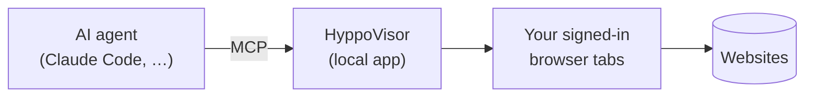

# HyppoVisor


**Hands for the web on the sites you're already logged into.**

HyppoVisor is a local Electron app. It opens URLs in real browser tabs that carry
your own sessions and exposes them to an AI agent over MCP. The agent reads pages
and drafts input. It never submits, sends, applies, or signs in — you do that.

<br clear="right" />

## Why

- **Your sessions, not a headless bot.** Real browser, real logins, you in control.
- **Read and draft, never act.** No submit, no messages, no credentials, no downloads.
- **Local and auditable.** Loopback only. Every interaction is logged to disk.

## How it works



1. **[Start HyppoVisor](docs/install-and-run.md)** — download a packaged build
   from [Releases](https://github.com/juliaviluhina/hyppovisor/releases), or
   clone and `npm start`.
2. **Log in** to the sites you want the agent to reach.
3. **[Configure HyppoVisor MCP for your AI agent app](docs/connect-an-agent.md)** —
   the in-app panel hands you a copy-ready command or JSON block.
4. **Connect it in your agent session** — `/mcp` in a Claude Code session
   (`claude mcp list` to check it's registered).
5. **Use HyppoVisor MCP in your agent session** — `open_url`, `read_page`,
   `interact`, … within what's [allowed and refused](docs/safety.md).

## Download & install

From [Releases](https://github.com/juliaviluhina/hyppovisor/releases), download
`HyppoVisor-<version>-arm64.dmg` (Apple Silicon — M1/M2/M3/…). Releases ship an
arm64 build only; for Intel, build from source.

Open the `.dmg` and drag `HyppoVisor.app` to Applications.

**This build is unsigned and un-notarized.** On first launch macOS Gatekeeper
reports it as **"HyppoVisor is damaged and can't be opened"** — misleading
wording; the app is fine. Right-click → **Open** does *not* get past this one.
Strip the download quarantine from the installed app instead:

```bash
xattr -dr com.apple.quarantine /Applications/HyppoVisor.app
```

If it still won't open, ad-hoc re-sign it:

```bash
codesign --force --deep --sign - /Applications/HyppoVisor.app
```

<!-- When a signed build ships, this workaround is superseded — see PACKAGING.md. -->

Building from source instead: [docs/install-and-run.md](docs/install-and-run.md).
Cutting a release: [PACKAGING.md](PACKAGING.md).

## Docs

| Doc | For |
|---|---|
| [Install & run](docs/install-and-run.md) | requirements, standalone use, from source |
| [Packaging](PACKAGING.md) | `npm run dist`, the license gate, LGPL swap, signing |
| [Connect an agent](docs/connect-an-agent.md) | HTTP + panel, stdio, verifying |
| [Configuration](docs/configuration.md) | env vars, precedence, `settings.json` |
| [Tools](docs/tools.md) | the eight MCP tools |
| [Safety](docs/safety.md) | what it refuses, and the nuances |
| [Security](docs/security.md) | the loopback threat model |
| [Development](docs/development.md) | tests and the e2e suite |

## License

[Apache-2.0](LICENSE) — free for any use including commercial; keep `LICENSE` and
`NOTICE` with any copy.

Design principles: [`.specify/memory/constitution.md`](.specify/memory/constitution.md).
