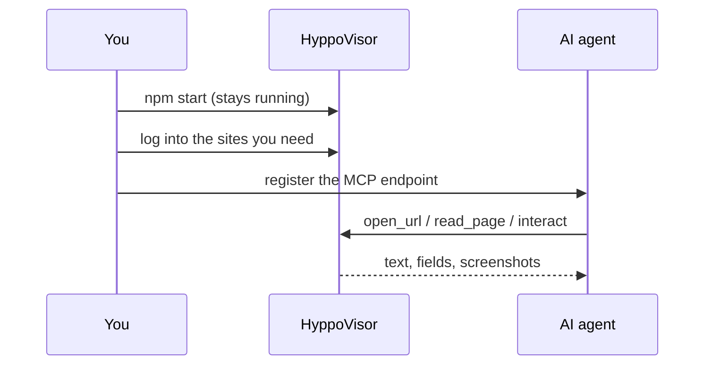

# Connect an agent

HyppoVisor is long-lived: you set it up once, the agent connects to it.



## Where the configuration lives

In the app — the **Connection & MCP** panel, opened with the hippo button in the
top bar (close with **✕**, `Esc`, or a click outside). It shows the live endpoint
(`http://127.0.0.1:7357/mcp` by default) and the ways to register it, plus:

- **Listening port** — change + **Apply**; rebinds live, remembered.
- **Require a bearer token** — generated, masked, **Reveal** / **Regenerate**;
  the snippets update to include it.
- **Tell your AI agent app** — a plain-language blurb to paste into context.

## Register it — pick one

**A. One command** (copy it from the panel):

```bash
claude mcp add --transport http --scope user hyppovisor http://127.0.0.1:7357/mcp
```

Drop `--scope user` to add it for the current project only.

**B. Hand-edit your agent's MCP config** with the panel's JSON block:

```json
{
  "mcpServers": {
    "hyppovisor": { "type": "http", "url": "http://127.0.0.1:7357/mcp" }
  }
}
```

**C. Paste the endpoint** wherever your agent app accepts an MCP URL.

### Running a named instance?

If you launched with `--instance <name>` (see
[Run more than one HyppoVisor](./configuration.md#run-more-than-one-hyppovisor)),
the panel's snippets use the server name `hyppovisor-<name>` and the instance's
live port, so registering a second instance never overwrites the first:

```bash
claude mcp add --transport http --scope user hyppovisor-work http://127.0.0.1:7358/mcp
```

The `initialize` handshake reports the same name, so a connected agent can
confirm which instance it reached.

## Then

```bash
claude mcp list      # or /mcp inside a session — confirm it's registered
```

Log into the sites you need in the HyppoVisor window. The app keeps running
across agent sessions.

## Give the agent a skill (optional)

`skills/hyppovisor/SKILL.md` in this repo is a ready-made skill for Claude Code /
Claude Desktop: it tells the agent how to pick a per-project `--instance` / `--port`,
register the `hyppovisor-<slug>` endpoint, confirm which instance it reached, and
stay inside the read-only / never-submit rules. Copy the folder into the project
that will use HyppoVisor:

```bash
mkdir -p .claude/skills
cp -r /path/to/hyppovisor/skills/hyppovisor .claude/skills/
```

## stdio (alternative)

No open port; the app starts and stops with the session. Must run under
`electron`, not `node`. Build first so `dist/main/index.js` exists.

```bash
npm run build
claude mcp add hyppovisor -e HYPPO_MCP_STDIO=1 -- \
  /absolute/path/to/node_modules/.bin/electron /absolute/path/to/dist/main/index.js
```

You cannot attach to an already-running instance this way — the client owns the
process. For a named stdio instance, append `--instance <name>` after the script
path and name the server `hyppovisor-<name>`:

```bash
claude mcp add hyppovisor-work -e HYPPO_MCP_STDIO=1 -- \
  /absolute/path/to/node_modules/.bin/electron /absolute/path/to/dist/main/index.js --instance work
```
