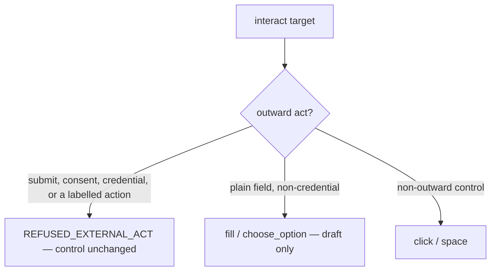

# Safety

The rule: **reveal content and prepare a draft; a human performs every act that
touches the outside world.**

## Always refused

`interact` refuses these with the named rule `REFUSED_EXTERNAL_ACT`, leaving the
control unchanged:

- **submit controls** — a `<button>` / `<input>` that submits a form (`click`, `space`)
- **any `click` inside a `<form>`** — filling a plain field there is still allowed
- **buttons / links labelled** save, confirm, submit, apply, send, delete, remove,
  connect, message, subscribe, pay, checkout, log in / sign in / sign up / register
- **consent checkboxes / switches** labelled accept, agree, consent, terms,
  privacy, opt in, subscribe — the `<label for>` is read too (`click`, `space`)
- **credential inputs** — `fill` / `space` on a password or one-time-code field
- **the Enter key** — never available on any operation
- **file inputs** — `<input type="file">` is listed by `read_form_fields` as
  `kind: "file"` with a refusing verdict; picking a file is a human step
- **address / place autocomplete** — `fill` types the literal text and stops;
  choosing a popped-up suggestion is a human step

## What `fill` is allowed to do

Type into a plain, non-credential, non-consent field (`text` / `email` / `tel` /
`url` / `search` / `number`, `<textarea>`, `contenteditable`) — including inside a
`<form>` and a combobox filter. It stays refused on `<input type="file">`,
`<select>`, a listbox, and a combobox container.

The `fields` batch (max 50) runs under the same rules: every target is checked
first, one bad target refuses the whole batch with nothing written; then writing
is best-effort and a vanished element is reported while the rest fill. No new
permission, never submits.

## Windows and popups

A page can't open a free-standing window. A plain http(s) `window.open` /
`target="_blank"` you clicked opens as a **new tab** (rate-limited). A sign-in
popup you triggered to a known identity provider (Google, Microsoft, Apple,
GitHub, Okta/Auth0, …) opens as a **modal window attached to the main window**,
shares the tab's session, and closes itself when login finishes — so OAuth
"Continue with …" works. Allowlist: `src/main/tabs/auth-popups.ts`. Downloads and
anything non-http or autonomous stay blocked and show in the notice line.

## The blocklist

One file — `src/main/safety/blocklist.ts` — enumerable, permits by default.
Every interaction, permitted or refused, is appended to `interaction-log.jsonl`
in the app's `userData` directory (never page text). That log is what makes an
unanticipated act detectable after the fact.
